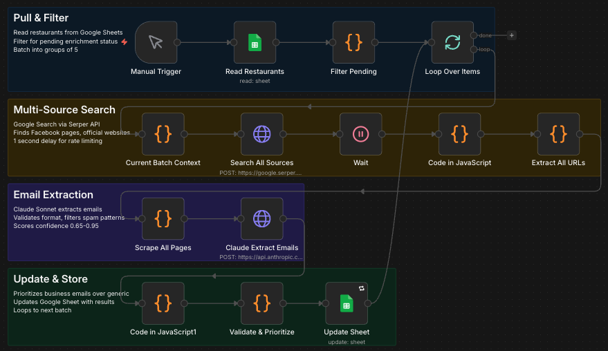

# Restaurant Lead Intelligence System


Automated lead qualification pipeline that discovers restaurant contacts, enriches with ICP scoring, and delivers prioritized outreach lists. Built with n8n, Claude AI, and Google Search APIs.

## Results

| Metric | Value |
|--------|-------|
| Email Discovery Rate | 65-80% |
| Cost Per State Run | $6.49 |
| Leads Per Run | 500-1,200 |
| Confidence Scoring | 0.65-0.95 |
| Execution Time | ~45 min (6 states) |

## How It Works

```
┌─────────────┐    ┌──────────────┐    ┌─────────────┐    ┌──────────────┐    ┌──────────┐
│  Discovery  │───▶│  ICP Score   │───▶│  Contact    │───▶│  Prioritize  │───▶│  Deliver │
│  ToastTab   │    │  Cuisine,    │    │  Discovery  │    │  By Score    │    │  Sheets  │
│  Scraping   │    │  Rating, POS │    │  Email/FB   │    │  & Tier      │    │  Export  │
└─────────────┘    └──────────────┘    └─────────────┘    └──────────────┘    └──────────┘
```

**Stage 1: Discovery**
- Scrapes ToastTab ordering pages via Google Search
- Extracts business name, address, cuisine type
- Targets 6 states: CT, MA, MD, MN, WI, IN

**Stage 2: ICP Qualification**
- Scores leads against Ideal Customer Profile
- Weights: Pizza/Italian (+25), Rating <4.0 (+20), Third-party delivery (+20)
- Filters out non-qualifying businesses

**Stage 3: Contact Discovery**
- Multi-source search: Facebook, official websites, directories
- Claude AI extracts and validates email addresses
- Filters spam patterns and generic domains

**Stage 4: Prioritization**
- Confidence scoring (0.65-0.95) based on email quality
- Tier assignment for outreach sequencing
- Deduplication across sources

**Stage 5: Delivery**
- Updates Google Sheets with enriched data
- Ready for CRM import or direct outreach

## Tech Stack

| Component | Technology | Purpose |
|-----------|------------|---------|
| Orchestration | n8n (self-hosted) | Workflow automation |
| AI Extraction | Claude Sonnet 4.5 | Email parsing, validation |
| Search | Serper API | Google Search results |
| Data Store | Google Sheets | Lead storage, export |
| Hosting | DigitalOcean | n8n instance |

## Cost Breakdown

| Service | Cost Per Run | Notes |
|---------|--------------|-------|
| Serper API | ~$3.00 | 10 searches/state × 6 states |
| Claude API | ~$2.50 | ~500 extraction calls |
| n8n Hosting | ~$0.99 | Prorated monthly |
| **Total** | **$6.49** | Per 6-state run |

## Workflows Included

### 1. ToastTab Lead Generator (`workflows/toasttab-lead-generator.json`)
Discovers restaurants using ToastTab POS via Google Search. Extracts business details from ordering pages.

### 2. Email Enrichment (`workflows/email-enrichment.json`)
Takes discovered leads and finds contact emails through multi-source search and AI extraction.

## Setup

### Prerequisites
- n8n instance (cloud or self-hosted)
- Serper API key ([serper.dev](https://serper.dev))
- Anthropic API key ([console.anthropic.com](https://console.anthropic.com))
- Google Sheets API credentials

### Installation

1. **Clone the repo**
   ```bash
   git clone https://github.com/YOUR_USERNAME/restaurant-lead-intelligence.git
   ```

2. **Import workflows to n8n**
   - Open your n8n instance
   - Go to Workflows > Import from File
   - Import both JSON files from `/workflows`

3. **Configure credentials**
   - Replace `YOUR_SERPER_API_KEY` in HTTP Request nodes
   - Replace `YOUR_ANTHROPIC_API_KEY` in Claude nodes
   - Connect Google Sheets OAuth credentials
   - Update `YOUR_GOOGLE_SHEETS_ID` with your sheet ID

4. **Set up Google Sheet**
   - Create a new Google Sheet
   - Use the schema from `/schemas/google-sheets-schema.json`
   - Required columns: Restaurant ID, Business Name, Address, City, State, Phone, Website, Status, Primary Email, All Emails, Enrichment Confidence, Last Enriched

5. **Test run**
   - Start with a single state to verify configuration
   - Check execution logs for any credential errors
   - Validate emails are being written to sheet

## Configuration

### Target States
Edit the `Generate Search Queries` node in `toasttab-lead-generator.json`:

```javascript
const targetStates = [
  { code: 'CT', name: 'Connecticut', searchQueries: [...] },
  { code: 'MA', name: 'Massachusetts', searchQueries: [...] },
  // Add or remove states as needed
];
```

### ICP Scoring Weights
Modify the scoring logic in the Filter/Score nodes:

| Factor | Default Weight | Rationale |
|--------|----------------|-----------|
| Pizza/Italian Cuisine | +25 | Higher delivery volume |
| Google Rating < 4.0 | +20 | More likely to need help |
| Third-party Delivery | +20 | Already delivery-focused |
| Review Count 100+ | +15 | Established business |
| Multi-location | +10 | Larger operation |
| Toast POS User | +10 | Tech-forward |

### Batch Size
Adjust in the `Loop Over Items` node:
- Default: 5 items per batch
- Increase for faster runs (higher API costs)
- Decrease for rate limit safety

## Design Decisions

**Why n8n over Zapier/Make?**
- Self-hosted = no per-task pricing at scale
- Code nodes for complex logic
- Better error handling and retry controls

**Why Claude AI over regex?**
- Handles malformed HTML gracefully
- Context-aware extraction (ignores nav emails, footers)
- Validates email patterns intelligently

**Why batch processing?**
- Respects API rate limits
- Allows partial completion on errors
- Easier debugging of failed items

## Transferability

This architecture works for any ICP-based lead qualification:

- **SaaS Sales**: Company enrichment + decision-maker discovery
- **Real Estate**: Property owner contact finding
- **Recruiting**: Candidate sourcing + contact enrichment
- **Agency Prospecting**: Business discovery + stakeholder identification

The pattern: Discovery > Qualification > Enrichment > Prioritization > Delivery

## License

MIT License. Use freely, attribution appreciated.

## Author

Built by [Mike Paulus](https://linkedin.com/in/mapaulus)

GTM Systems Engineer | Revenue Infrastructure | n8n, Python, SQL, CRM Automation
